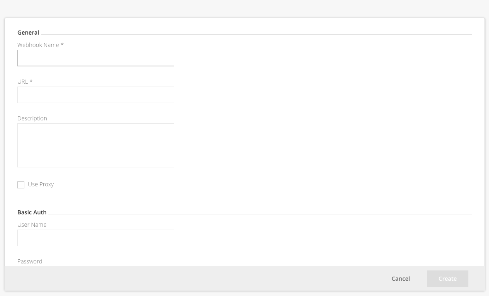

# Configuring Webhooks in Xray

One of the options when configuring Watches is to have them invoke webhooks, which are proprietary URLs you can define to perform custom actions as a result of a violation being issued. Webhooks are configurable in the **Administration** module under **Xray | Webhooks**.

## Adding a Webhook

To add a webhook, click **New Webhook**.

### Webhook Fields

| Field                  | Description                                                                                      |
|------------------------|--------------------------------------------------------------------------------------------------|
| **Webhook Name**       | An identifier for the webhook. This is the name that will be used by any Watches that want to invoke the webhook in case of a violation. |
| **URL**                | The URL that this webhook invokes. For details of the payload provided by Xray to the webhook, please refer to [Webhook Payload](#). |
| **Description**        | A free text description.                                                                         |
| **Use Proxy**          | Set the webhook to go through the predefined proxy. For more information, see [Managing Proxies](#). |
| **Basic Auth**         | User Name/Password: A username and password as required by the webhook.                         |
| **Custom Headers**     | Any custom headers that may need to be added to invoke the webhook.                              |