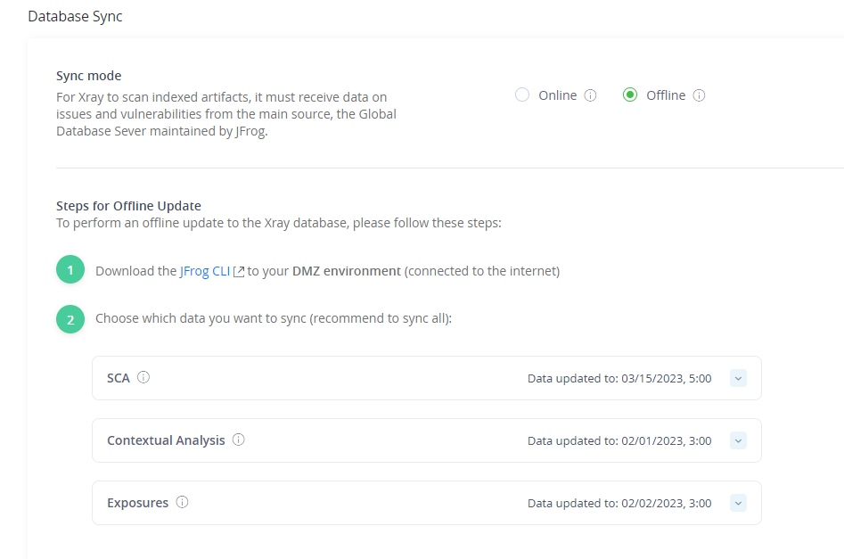

# Xray <-> Jfrog External DB Sync

For Xray to scan your indexed artifacts, it must ingest data on issues and vulnerabilities from the **global database server** maintained by JFrog. There are two ways to synchronize Xray with the global database server:

- **Online:** In online mode, Xray synchronizes with the global database server automatically on a daily basis through an internet connection.
  
- **Offline:** In offline mode, you manually download files from the global database server and then upload them to Xray.

## Online Synchronization

To get started right away so Xray can scan your artifacts, you may invoke the initial synchronization manually by selecting **Start Sync** in the **Status** panel. From then on, Xray will synchronize issues and vulnerabilities regularly and automatically, once a day.

### Using a Firewall?

If you are using a firewall, to allow the database sync to complete successfully, you need to add the following URLs to your firewall's whitelist:

1. `https://releases.jfrog.io/`
2. `https://releases-cdn.jfrog.io`
3. `https://dl.bintray.com/`
4. `https://akamai.bintray.com`
5. `https://jxray.jfrog.io`

To test the ability to sync, run the following REST API endpoint:

~~~
https://jxray.jfrog.io/api/v1/system/ping
~~~

## Offline Synchronization

### Notes

* The Xray indexing process will only start after the initial DB sync process is completed.

* An offline database synchronization requires the use of JFrog CLI.

* For RPM installations, the **Updates** folder is under the **Data** folder:

  - `${XRAY_HOME}/xray/data/updates/component`
  - `${XRAY_HOME}/xray/data/updates/vulnerability`
