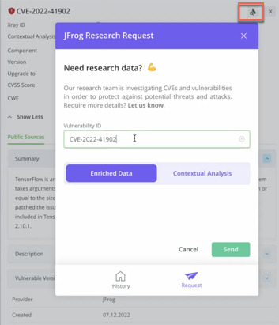

# Advanced Security

_Advanced Security is available with the **Enterprise X** or **Enterprise+** license, along with the **Advanced Security Add-on**._

## **Helping You Address Vulnerabilities Effectively**

JFrog Advanced Security leverages extensive research from JFrog’s Security research team to provide deep insights into security issues, their impact on your software, and how to address them. By prioritizing risks, Advanced Security offers contextual remediation advice, helping developers focus on the most critical threats for better protection.

With thousands of vulnerabilities detected, developers often struggle to sort through irrelevant issues, making the process time-consuming and prone to errors. Additionally, non-code-related security issues, such as insecure configurations or weak authentication, are frequently overlooked, leaving software vulnerable. Advanced Security minimizes this noise, highlights relevant vulnerabilities, and addresses overlooked security risks to improve overall software protection.

Advanced Security helps address these challenges with its advanced capabilities:

* **Vulnerability Contextual Analysis**: Minimize false positives and noise by understanding which CVEs apply to your application, ensuring you focus on relevant issues.
* **Exposures**: Detect security risks in your configurations and open-source libraries, covering various forms of software supply chain attacks.
* **SAST (Static Application Security Testing)**: Identify, fix, and learn about security issues in your code. JFrog SAST focuses on sensitive operations (e.g., database queries, OS commands, outgoing connections) that can be exploited by external attackers if not properly sanitized.

## Our Research Team

The JFrog Security research team continuously identifies and prioritizes CVEs, offering advanced security data and step-by-step remediation guidance. By providing contextual advice, the team helps developers focus on the most impactful CVEs.&#x20;

Read all about our research team [here](https://research.jfrog.com/).

### Submit a Request

You can also request additional security information for specific CVEs of interest using the JFrog Research Request feature, granting access to enriched CVE and contextual analysis data.

<figure><figcaption></figcaption></figure>
