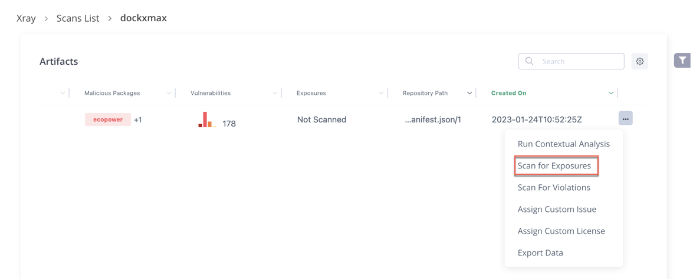
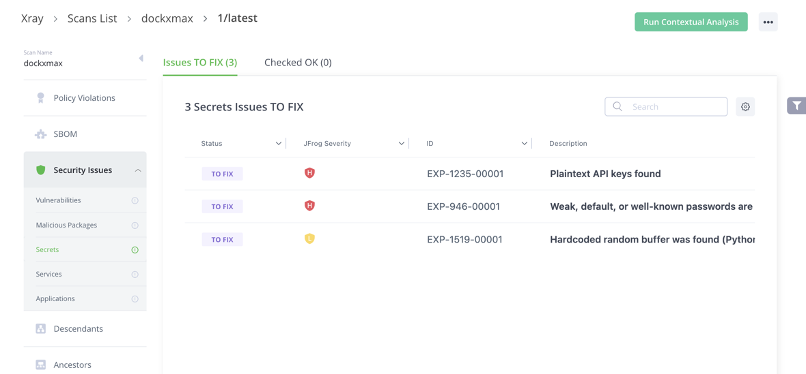

# Run an Exposure Scan on an Existing Artifact

**Run an Exposure Scan on an Existing Artifact**

Starting from Xray version 3.66.x and above, you can scan for Exposures on an existing artifact. Do the following:

1. From the **Scans List** page, **Repositories** tab, select the repository.
2. Navigate to the artifact you want to scan.
3. Click the Actions Menu next to the artifact, and select **Scan for Exposures**.

The results appear under **Security Issues**.

