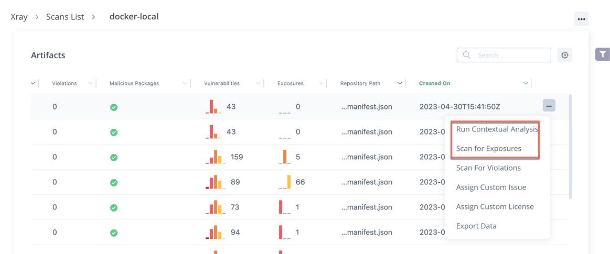
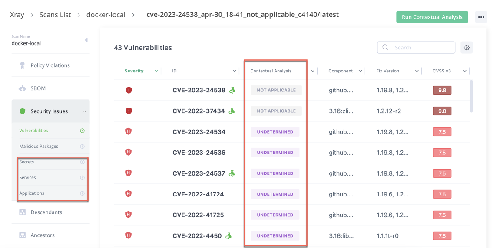

# Advanced Scans on Existing Artifact

#### Advanced Scans on Existing Artifact 

Do the following:

1. From the **Scans List** page, **Repositories** tab, select the repository.
2. Navigate to the artifact you want.
3.  Click the **Actions Menu** next to the artifact, and select **Run Contextual Analysis** or **Scan for Exposures**.

    

The results appear under Security Issues.

