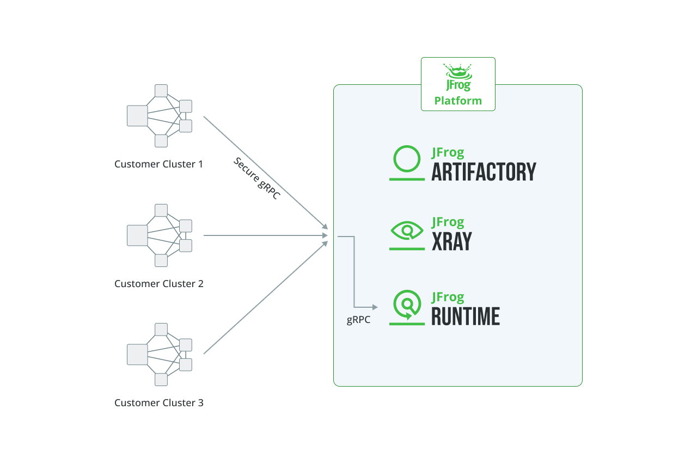
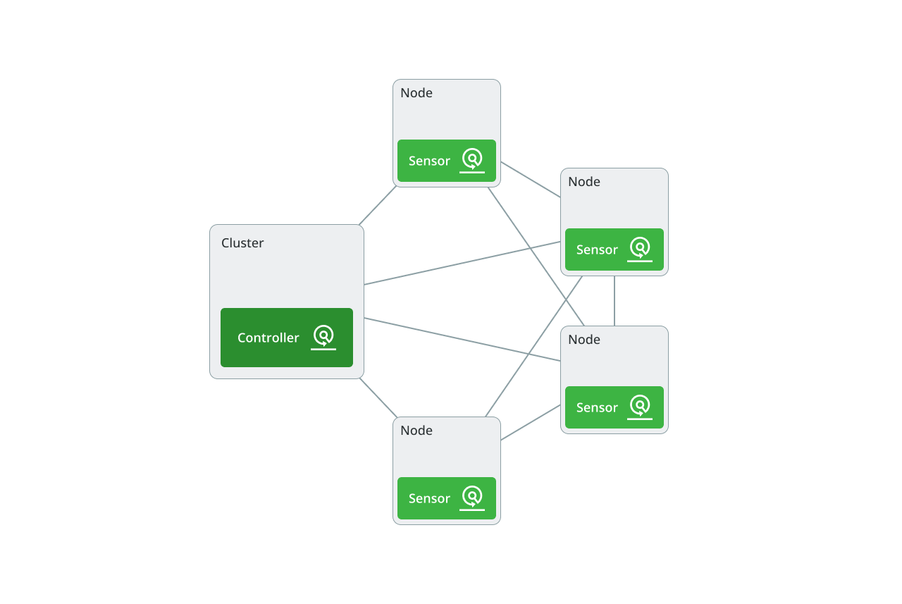

# Runtime

**JFrog Runtime** provides in-depth security and operational insights for Kubernetes cluster environments. It is powered by the JFrog end-to-end security coverage. JFrog Runtime allows you to ensure that Artifactory is your one source of truth for binary management. It detects vulnerabilities, integrity violations, and untrusted registries in real time. By continuously monitoring the runtime state of workloads and containers, it enables security and DevOps teams to identify and mitigate threats on cloud environments. The platform flags unauthorized or untrusted images, preventing the execution of code from unverified sources. It integrates with JFrog Artifactory and Xray, allowing for a comprehensive security posture that spans both pre-deployment and live runtime environments.

## **Before You Begin**

It is essential you have:

* Artifactory version 7.77.20
* Xray version 3.104.08

## **How JFrog Runtime Collects Information**

JFrog Runtime acquires its data through two primary mechanisms: the JFrog Platform and dedicated sensors deployed within customer clusters.

### **JFrog Platform Integration**

JFrog Runtime integrates with the broader JFrog Platform, which includes Artifactory, Xray, and Advanced Security. This integration allows it to:

* Correlate runtime artifacts with their sources in Artifactory for complete trust in your Runtime environment.
* Enrich runtime data with security insights from Xray, identifying vulnerabilities and malicious packages on an ongoing basis based on JFrog Catalog and JFrog research information.
* Aggregate and analyze data for security triaging and prioritization.

<figure><figcaption></figcaption></figure>

### **Runtime Sensors Installed in Customer Clusters**

Within Kubernetes environments, JFrog Runtime deploys specialized sensors to collect real-time runtime data. These sensors:

* Monitor running processes, file access, and kernel activity using eBPF technology.
* Detect security threats and integrity violations in real time.
* Transmit collected data securely to the Runtime Service within the JFrog Platform for further analysis.

<figure><figcaption></figcaption></figure>

## **Runtime Modes of Deployment**

JFrog Runtime offers two modes of deployment, each designed for different levels of security coverage and cost considerations.

### **Runtime Integrity** (Controller-only)

**Runtime Integrity** enables communication with the Kubernetes API. It tracks Kubernetes cluster activity, including resource execution and orchestration, and collects data on Nodes, Workloads, Pods, and Containers.

Runtime Integrity provides foundational security insights by:

* Communicating directly with the Kubernetes controller API.
* Focusing on monitoring Kubernetes cluster resources such as Nodes, Workloads, Pods, and Containers.

### **Runtime Impact** (Controller + Sensors)

**Runtime Impact** installs on each node within a Kubernetes cluster an eBPF sensor for capturing detailed runtime behavior at the process and file level. It sends collected data to the Runtime Service for security analysis and is deployed via Kubernetes DaemonSets with host privileges.

Runtime Impact delivers a granular and comprehensive runtime security assessment by:

* Deploying a sensor on every cluster node for deeper visibility.
* Monitoring container runtime behavior, process executions, and file interactions.
