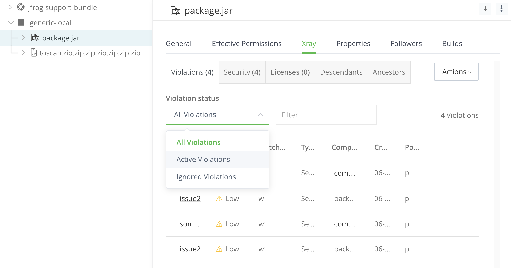

# Ignore Rules

> #### Note
>
> This feature is available with Artifactory version 7.10.5 and above.

In some cases, when violations are detected, as security or legal personnel, you would like to accept or whitelist some of these violations. This could be for different reasons, such as:

* Although the security vulnerability is real, you have ways to protect against it (such as a WAF configuration).
* The conditions needed for this vulnerability to happen are not met in the specific case.
* As an organization, you are aware of the violation, but you would still like to release the product.
* The violation is not a showstopper, and you would like to deal with it in future versions.
* The violation is a false positive.
* The violation is valid, but you need more time to deal with it. Time based ignore enables you to silence the violation for a period of time. Once that period expires, the Ignore Rule will be deleted automatically, and if the violation occurs again it will not be ignored moving forward.

In such cases, the ignore violations feature, enables you to have granular control on the violations that should be ignored. Xray allows you to define the scope of the ignore rule on the vulnerability, component, artifact, watch level, and more. Thus, giving you the flexibility and control needed to apply the ignore rule.

### Ignore a Violation

Follow these steps to create an **Ignore Rule** for a violation. When creating an ignore rule, the ignore rule is applied to the specific violation and all future violations that meet the ignore rule criteria. For a number of examples on when you might want to ignore violations, see [Ignore Violations Examples](https://jfrog.com/help/internal/api/webapp/print/d78555a2-5bbe-41b2-bf4c-9749412b1e26#topic-tL0gYBJ7L7hTW_px8sD8lw).

1. Select the required Watch and click the **Violations** tab.

&#x20;

<figure><figcaption></figcaption></figure>

You can also view violations for an Artifact, Build, or Release Bundle by selecting the Violations tab in a Package, or in the specific Artifact, Build, or Release Bundle. You can filter to see only ignored violations.

\

<figure><figcaption></figcaption></figure>

From the **Violations** list, hover over the required violation in the list and click  **Ignore Violation**, located on the rightmost side of the line.

The **Create Vulnerability Ignore Rule** dialog box appears.

&#x20;

<figure><figcaption></figcaption></figure>

> When selecting the ignore criteria, take note of the combinations you choose. Some combinations such as selecting everything as **Any** is not allowed as it will ignore all future violations (in the watch or in the system).
>
> The Ignore Rules REST API allows you to choose more scopes for the Ignore Rule as well as more options in each scope.

