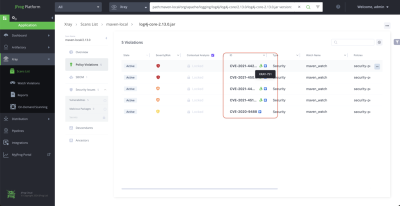
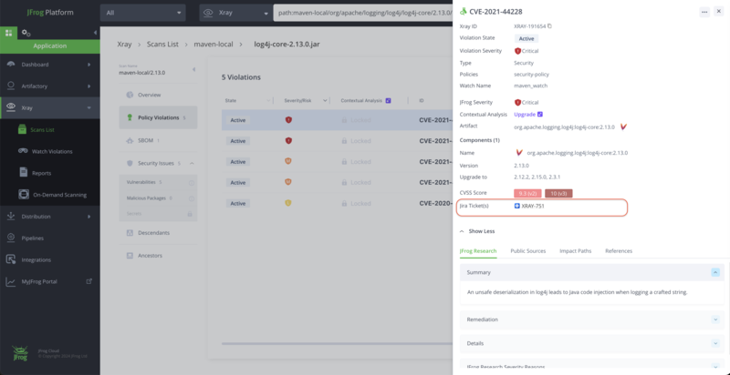

# View Jira Tickets Created with Xray Integration

When the tickets are created, you can see the Jira icons against the violation, and the details view in the UI.

<figure><figcaption></figcaption></figure>

<figure><figcaption></figcaption></figure>

In Xray reports, the violations reports of Xray, also have the ticket ID wherever applicable.
