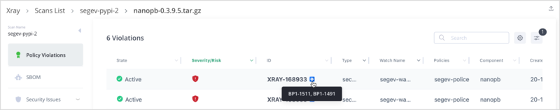
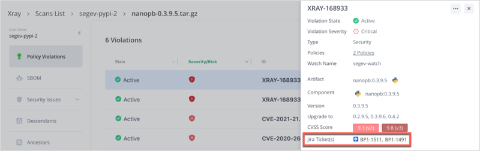

# Manually Create a Jira Ticket

**More Permissions for OAuth2**

If you have set up Jira integration with Xray using OAuth2, manual creation of Jira tickets requires some extra permissions. Ensure that the permissions are updated before manually creating Jira tickets. For more information, see Connecting Jira to Xray Using OAuth2.

To manually create a Jira ticket:

1. In the **Application** tab, navigate to a violation on one of the following pages:
   * **Artifactory > Builds**
   * **Artifactory > Artifacts**
   * **Scans List > Repositories**
   * **Scans List > Builds**
   * **Scans List > Release Bundles**
   * **Watch Violations**
2. Click the vulnerability ID, and in the window that appears on the right, click the action button (three dots) and click **Create a Jira**.
3. In the **Create a Jira Ticket** window, update the following fields:

| Field            | Description                                                                                                                                                                                                                  |
| ---------------- | ---------------------------------------------------------------------------------------------------------------------------------------------------------------------------------------------------------------------------- |
| **Profile Name** | 
This dropdown lists all the Jira configuration profiles that were defined when creating the Jira integration.

Click to select the relevant profile.
                                                             |
| **Issue Type**   | This is auto-filled according to the profile selection.                                                                                                                                                                      |
| **Labels**       | This is auto-filled with all the labels. The drop-down displays the labels on the profile integration page. While you can remove the label from the field, it will not delete it from the main profile integration.          |
| **Component**    | This is auto-filled. The drop-down lists all the components affected by the vulnerability and all components are selected by default. You have the option of selecting a subset of the listed components.                    |
| **Title**        | The is auto-filled based on the type of violation.                                                                                                                                                                           |
| **Description**  | 
This is auto-filled and cannot be edited.

Description is auto-filled based on the violation's current state and the selected components. If the components are changed, the description is updated accordingly.
 |
| **User comment** | Add relevant comments for the ticket.                                                                                                                                                                                        |

1. Click **Create**.

**Note**

If a ticket has already been created for the issue, you have the option of updating it.

### Jira Ticket Indicator

Whenever a Jira ticket is manually created for a violation, it is indicated with an icon . Hover over the icon to see the list of Jira tickets that have already been created for the violation. If there are multiple tickets, the last created ticket will be the leading ticket.

<figure><figcaption></figcaption></figure>

The Jira indicator along with the Jira Id is also shown on the Details screen. Clicking on a Jira Id redirects you to the Jira page for that ticket.

<figure><figcaption></figcaption></figure>

To manually update a Jira ticket:

1. In the **Application** tab, navigate to a violation on one of the following pages:
   * **Artifactory > Builds**
   * **Artifactory > Artifacts**
   * **Scans List > Repositories**
   * **Scans List > Builds**
   * **Scans List > Release Bundles**
   * **Watch Violations**
2. Click the vulnerability ID that already has a Jira indication, and in the window that appears on the right, click the action button (three dots) and click **Update a Jira**.
3. In the **Update a Jira Ticket** window:
   1. If there are multiple tickets, click the **Jira Ticket Number** drop-down to select the ticket to be updated.
   2. Scroll down to the **Add Comments** field and add relevant comments for the ticket.
   3. **Note**
   4. All the other fields are grayed out and cannot be updated.
4. Click **Update**.

The **Title** and **Description** are automatically updated based on the current state of the violation.

**Note**

If you try to update a ticket that has already been deleted, a message is displayed to that effect and you will have the option of creating a new ticket.
