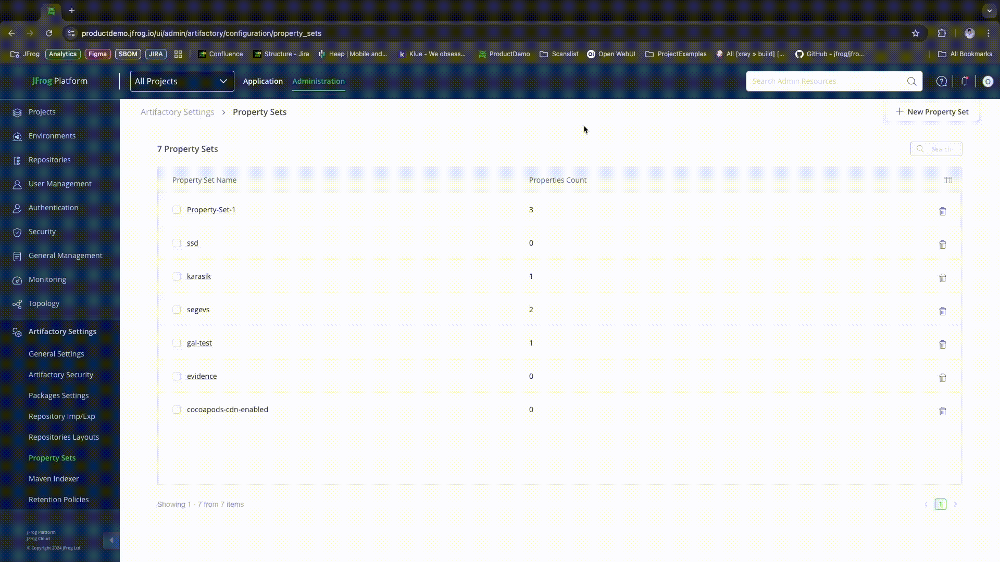
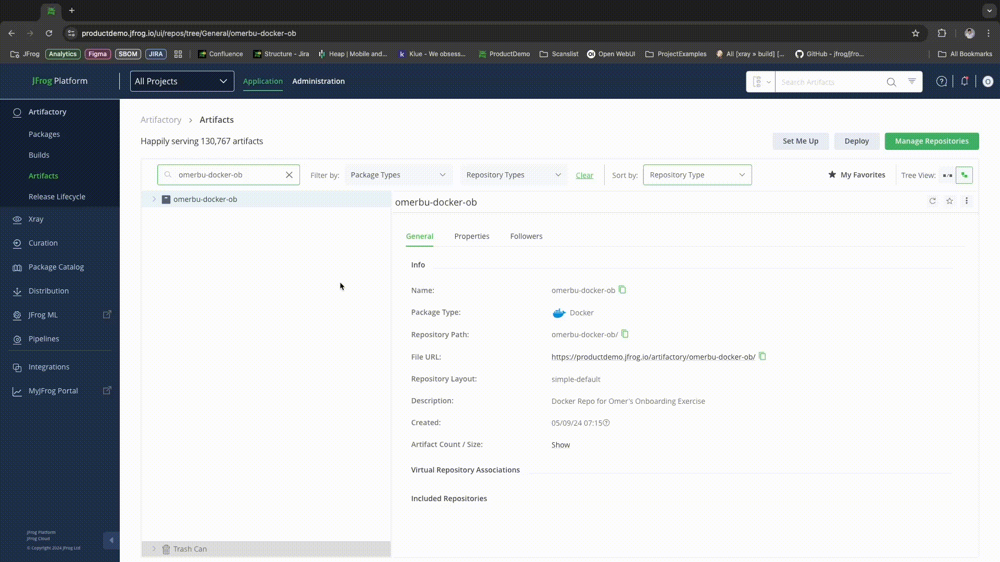

# How to Filter Out Your 1st Party Components in CycloneDX SBOM report

> Feature is supported in Xray Version 3.108 or later.

## Via UI

### Creating Filter Property Set

1. Go to Administration -> Artifactory Settings -> Property Sets

<figure><figcaption></figcaption></figure>

2. Create a property-set called "sbom.report.filtered"
3. Create a property (in this example we'll use "first-party-comps") and choose "Multi-Select"
4. Enter the component Names you want to filter (with version number if you want to be explicit)
5. Save the property set

<figure><figcaption></figcaption></figure>

### Apply Property Set to Repositories

1. Go to "Repositories" and under a repository "Advanced" Tab - select the "sbom.report.filtered" for the repository.

### Applying Filter Set to Artifacts

1. Go Artifactory -> Artifacts and choose a repository / artifact to apply the filter set to.
2. Choose your newly created property set and in the values choose the components to filter.
3. Toggle the "Recursive" Option to apply to all artifacts in the repository

<figure><figcaption></figcaption></figure>

That's It! Now when you'll export an SBOM report - your 1st party artifacts will not appear in the report.

## Via REST API

Use Artifactory Set Property API

```
PATCH artifactory/api/metadata/artifact-repo?&recursiveProperties=0&atomicProperties=0
{
    "props":{
        "sbom.report.filtered.1st-party-comp1": "go://acme.com/acme-internal"
        "sbom.report.filtered.1st-party-comp2": "pypi://acme-lib:5.13.0"
    }
}
```
