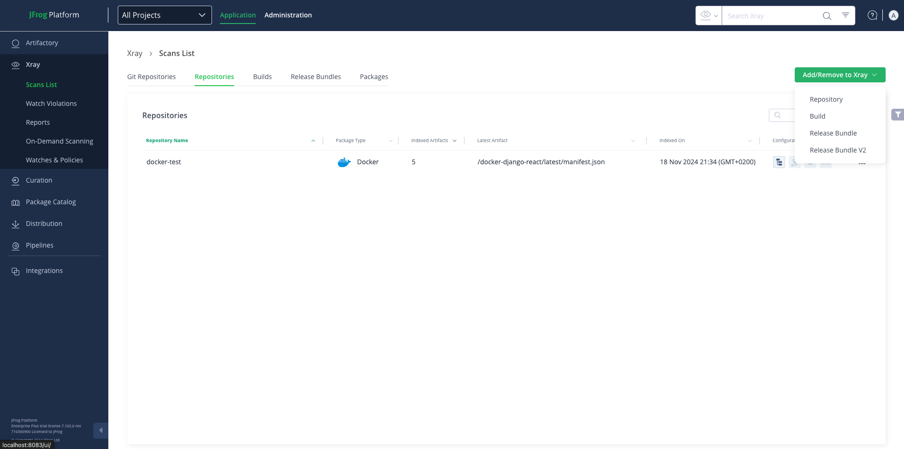
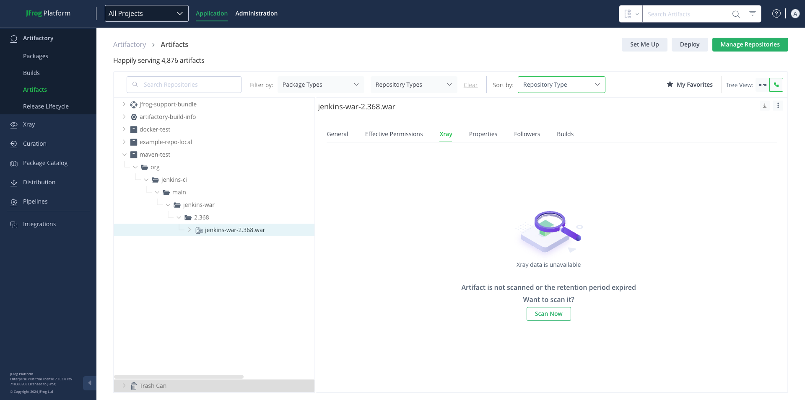
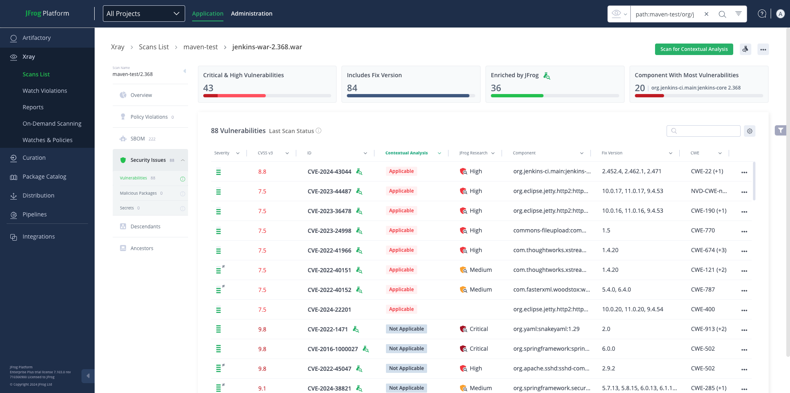
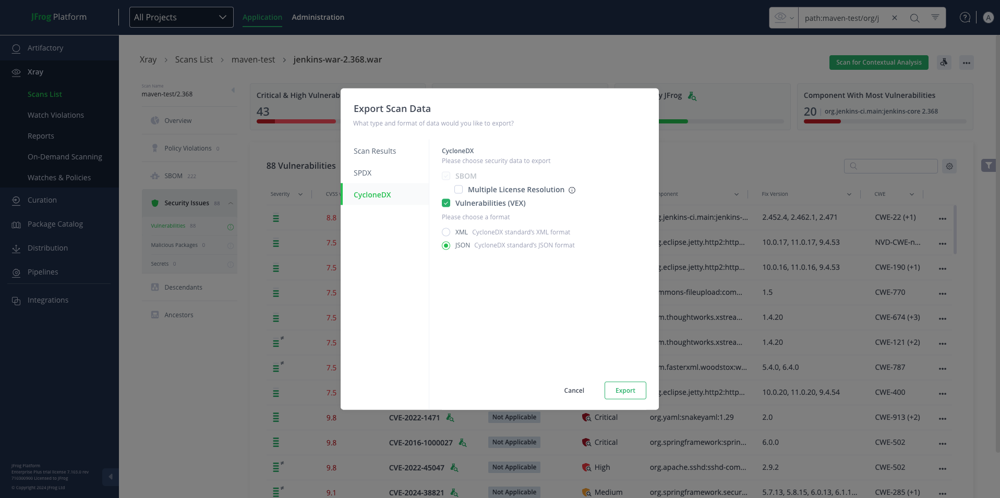

# Quick Start

## Prerequisites&#x20;

To quickly Get Started With Jfrog Xray you need :

* [Have Xray Installed ](https://jfrog.com/help/r/jfrog-installation-setup-documentation/installing-xray)
* Have "Manage Xray Data" Permission

## 1. Add Resources to Xray&#x20;

1. Go To Scans List&#x20;
2. Press The "Add/Remove to Xray" Button
3. Choose the resource type you want to scan.

<figure><figcaption></figcaption></figure>

4. Done! Now Every artifact added will be automatically scanned by Xray

### Alternative -  Scanning Artifacts already on JFrog Artifactory

1. Go to the selected artifact in artifactory
2. Press the Xray Tab
3. Press "Scan Now"

<figure><figcaption></figcaption></figure>

## 2. View Artifact Vulnerabilities

1. Go to Scans List Page
2. Press the Scanned Artifact&#x20;
3. Press The "Vulnerabilities" tab under  "Security Issues" &#x20;
4. Done! Now you can see all the vulnerabilities in your artifact

<figure><figcaption></figcaption></figure>

## Export your Scan Findings to an SBOM file

Now that you indexed your repository, scanned your artifact and saw the results - you want to create an SBOM report which contains the entire scan results along with the VEX (Vulnerability Exploitablity Exchange) so you can share it outside the Jfrog Platform.

1. Press the \[...] Button on the "Scan Results" Page
2. Press "Export Scan Data"
3. Press "CycloneDX" Option
4. Toggle "Vulnerabilities (VEX)" Option so the vulnerabilities will be included in the report
5. Press "Export"
6. Done! the scanned artifact SBOM report (with the VEX) is downloaded to your computer.

<figure><figcaption></figcaption></figure>

