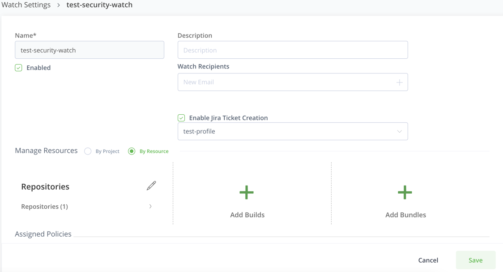
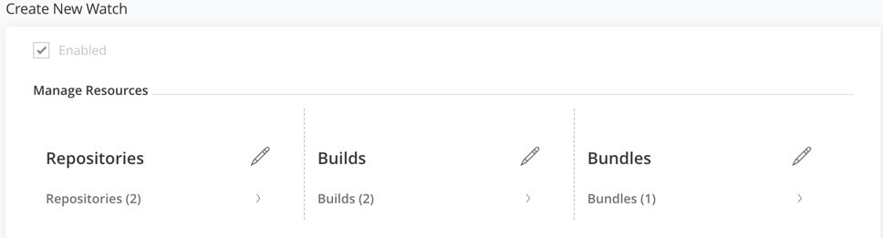
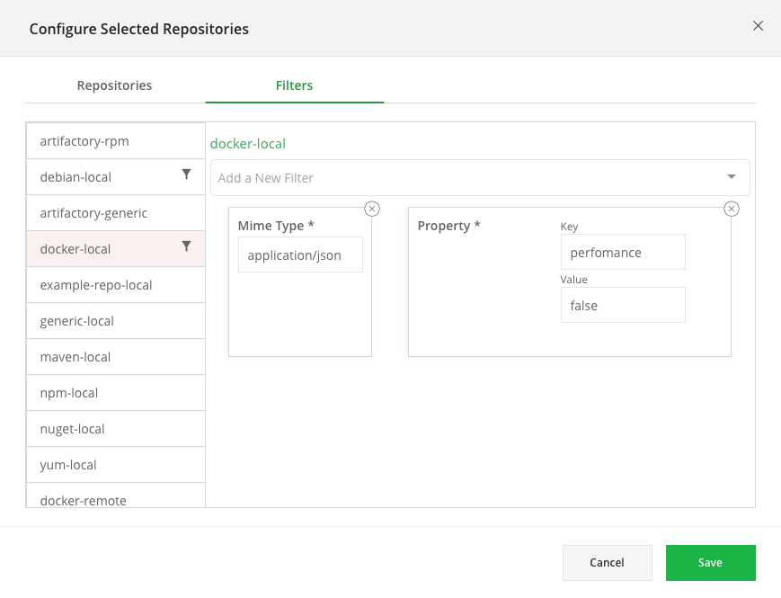
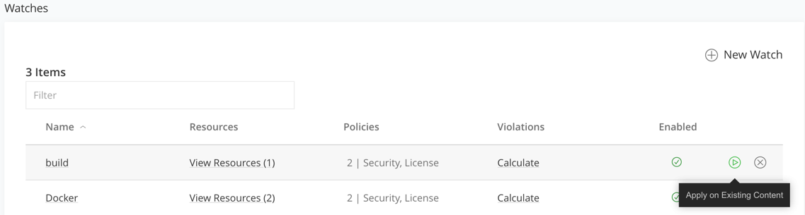
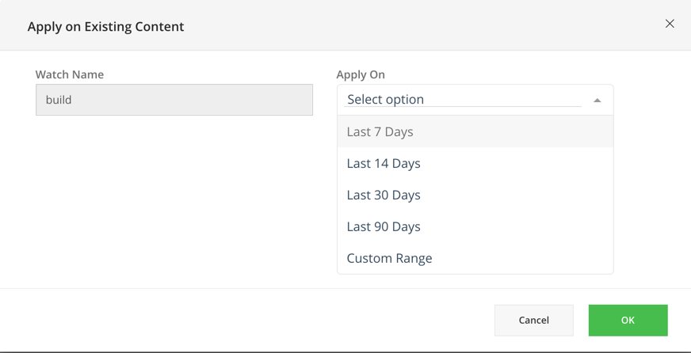

# Watches

Xray Watches are the focal point for viewing and managing your security and license violations in the JFrog Platform. Watches provide you with the flexibility you need to meet your specific security and violation requirements. You select the resources you would like to scan for security vulnerabilities and compliance and determine the actions to be taken once a security vulnerability is detected. For more information on how JFrog Xray processes watches and policies, see How Does Xray Scan Your Artifacts?

#### How Does Xray Process Policies on a Watch? 

When scanning an artifact, Xray completes the following steps for each resource added to a Watch:

1. **Check existence**: Xray checks if the artifact exists in the resource
2. **Check filters**: Xray then checks if the artifact matches all of the filters defined for that resource.
3. **Process Assigned Polices**: Xray independently processes all of the policies in the Watch. For each assigned policy, Xray performs the following steps:
   1. Processes the **rules** according to priority.
   2. Checks the **criteria** of the rule.
   3. If the criteria are met, Xray generates a **violation**, the **automatic actions** are executed and the policy is considered as **processed**. There is no need to continue to the subsequent rules in the policy.
   4. If the criteria are not met, Xray continues to the **next rule**.
   5. In case none of the rules apply, the policy is considered **processed**, and Xray continues to the next policy if one exists.

## Create a Watch

### Configure General Watch Settings

1. In the **Administration** module, select **Watches** **& Policies** and from the **Watches** tab click **New Watch**.
2.  In the **Create New Watch** page, set the general information on the watch and assign Watch recipients on the watch.

    When selected, all the Watch recipients will receive email notifications if a policy set to notify recipient has detected a vulnerability.

&#x20;

<figure><figcaption></figcaption></figure>

### Assign Resources to the Watch

#### Permissions Apply

You can only see resources in a Watch if they are indexed for scanning by Xray and you have "View" permission on the resource.

You can only add resources to a Watch or remove them if they are indexed for scanning by Xray and you have "Manage" permission on the resource.

The next step is to assign resources to a Watch. The Resources are the set of repositories and builds in the connected Artifactory services that the Watch monitors. If you are using Projects, you can select Projects as resource.

Managing resources for a Watch involves two steps:

1. Specifying the repositories, builds, Release Bundles, and Projects to monitor.
2. Applying filters to focus only on those artifacts within those repositories and builds that you are interested in.

To assign resources on a watch:

* In the **Manage Resources** section, access each resource type and select the resources to be monitored.

<figure><figcaption></figcaption></figure>

*   Select the resources to be included within each resource type. You have a number of options to select the resources to be included:

    \- All resources within the resource type: Set the **Any Repository**, **Any Build**, **Any Bundle** or **Any Project** checkboxes to monitor all those resources that have been specified for indexing by Xray. Note that this setting will also apply to new repositories and builds that are created after the Watch is defined. - Packages: Set according to the **Repo Path Include** and **Repo Path Exclude** patterns. - Builds and Release Bundles: Select **By Name** or **By Pattern**.

\- Projects: Select **By Name** or **By Pattern (project keys)**.

* Move the resources you are interested in from the list of Available Resources on the left to the list of Selected Resources on the right by dragging them, or by selecting them and using the arrow icons.

> #### Scanning External Resources
>
> From version 2.6, when scanning builds for supported package formats, external (transitive) dependencies that are not directly included in the build are **also** scanned and will trigger violations if they meet the criteria specified in a Watch. Currently, the supported package formats are: **Maven**, **NuGet**, **npm** and **Gradle** and scans external resources using SHA-256.

### Set Filters on Repositories

The filters you define for a watch determine which artifacts in the repositories specified will generate violations and under what conditions. You can define any number of filters on each of the repositories specified for the watch, and it will only trigger a violation if an artifact meets the conditions of all of the filters defined for that resource.

#### Pass through ALL filters

You can define any number of filters for a resource, and only artifacts that pass through all of them will trigger a violation.

1. To specify filters on repositories, select the **Filters** tab.
2. Select the repository. The repository will be displayed in the right column with a list of predefined filters.
3.  Select a filter from the Filter list to apply to the repository.

    In the following example, you set a filter to trigger a violation for application/JSONs if their performance value is set to false in the docker-local repo.

<figure><figcaption></figcaption></figure>

### Assign Policies to a Watch

1. To assign a policy to a watch, click **Manage Policies** in the **Assigned Policies** section.
2. From the list of Available Policies on the left, select the policies you want to apply to the Watch and drag them, or use the arrows to move them to the list of Selected Policies on the right.
3.  Click **Save** to assign the policies to the Watch.

> #### Editing a Policy
>
> Edits made to a policy will automatically be applied to all watches the policy is assigned to. This will take effect only for newly scanned artifacts. You can manually apply the watch on existing artifacts.

## Manually Activate a Watch

Once a **Watch** is created, it will scan artifacts in the specified resources when a scan-triggering event happens, and issue Violations accordingly. However, until a scan-triggering event happens, artifacts already existing in the system will not be scanned by the Watch. So, to make sure a Watch is immediately applied to the relevant artifacts, you can invoke it manually by hovering over it and selecting **Apply on Existing Content**.

> #### Not available for All Repositories or All Builds
>
> You can only manually invoke a Watch on existing content if the Watch is defined on specific resources and not on All Repositories or All Builds

<figure><figcaption></figcaption></figure>

Clicking the button pops up a dialog that lets you specify which of the resources assigned to the watch should be scanned, and a date range that defines when the artifact was last scanned by Xray.

For example, selecting **Last 7 days** will only scan artifacts that have been scanned in the last 7 days.

<figure><figcaption></figcaption></figure>

