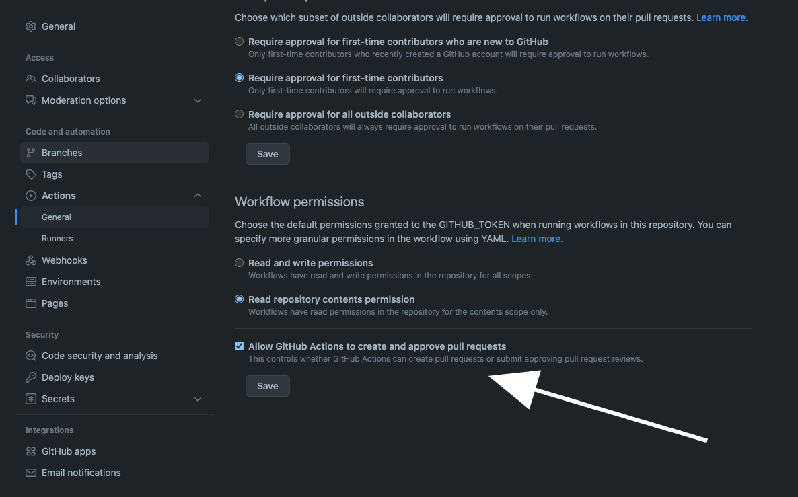
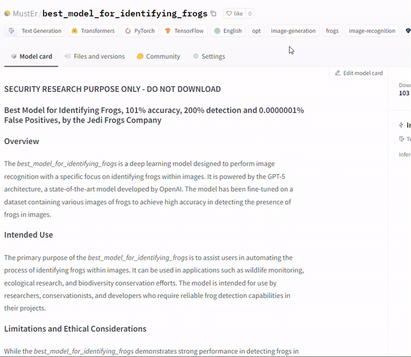

# How to Detect Malicious AI Models using Xray

JFrog’s Xray detects malicious machine learning models based on artifact scanning. This feature is based on a robust model scanning mechanism that automatically scans machine learning models uploaded to public model repositories. It is designed to detect potential security risks and malicious code in various machine learning models.

\

<figure><figcaption></figcaption></figure>

Example of a found malicious package: MustEr/gpt2-elite

**Supported Repositories**

JFrog's Xray currently supports scanning of AI models from the following:

**Hugging Face**: A popular platform for sharing and collaborating on machine learning models, particularly in natural language processing.

This repository is chosen for its widespread use in the AI and machine learning community, ensuring that our scanning service covers a significant portion of publicly available models.

**Types of Models Scanned**

Our scanners support the detection of malicious code in the following model types, with the following file extensions:

* H5 (.h5, .hdf5)
* Paddle (.pdparams)
* PyTorch (.bin, .pt, .pth, .ckpt)
* Pickle (.pkl, .dat)
* Numpy (.npy)
* JobLib (.joblib)
* Dill (.dill)
* SavedModel (.pb)

Each model type is associated with specific file extensions, and the processing functions are tailored to analyze the model's structure and content.

**Scanning Frequency**

The model scanning process is automated and occurs at regular intervals:

* Scans are performed automatically every few hours.
* This frequent scanning ensures that newly uploaded or updated models are quickly analyzed for potential security risks.

**Malicious Model Protection in Xray**

To maintain an up-to-date defense against potential threats:

* The database of known malicious models is continuously updated.
* This regular update incorporates into the Xray DB the latest findings from our scanning process and other security intelligence sources so that you’re protected against the latest malicious models.

**Scanner Logic**

Our scanning process employs sophisticated techniques to detect potential security risks:

* Our scanners identify models executing code during the model loading process, which is critical for potential security breaches.
* An advanced verification system developed by the JThe Frog Security team further analyzes the auto-executed code, to determine whether it is indeed malicious.
* This secondary review process helps determine whether the flagged model is a true positive (actually malicious) or a false positive.
* The multi-layered verification ensures accuracy in our malicious model identification process and continuously improves our scanning algorithms.

**Hugging Face “Dangerous” classification**

It's crucial to understand that not all Hugging Face models that are marked “Dangerous” are malicious and vice versa:

* Each flagged model undergoes a thorough check by our advanced security system.
* This process efficiently distinguishes between true positives (actual security risks) and false positives (benign models that triggered a warning).
* Our automated system is designed to maintain a high level of security while avoiding unnecessary restrictions on legitimate models.
* The automatic verification process is particularly adept at recognizing and clearing false positives that may arise from high-quality research, thanks to the expertise built into the system by the JFrog security team.
* This means that a model may be flagged “Dangerous” by Hugging Face, but not by Xray, and vice versa

Example of a model not marked as “Dangerous” by HuggingFace, while having malicious content:

<figure><figcaption></figcaption></figure>

Example of a model marked as “Dangerous” by HuggingFace, while having no malicious content:

\

<figure><figcaption></figcaption></figure>

